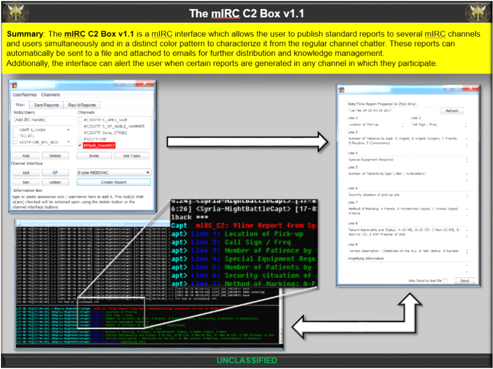
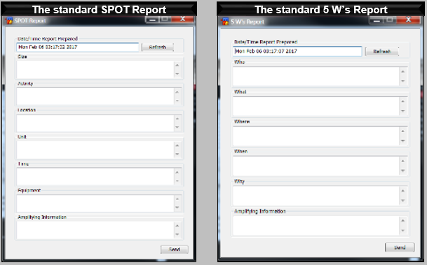

# mIRC_C2
This repository holds a mIRC Interface created to help lower staffs submit reports to higher staffs, and for management of mIRC rooms.

Part of the future of this project should include ways to make this interface into a .dll instead of a bunch of scripts.
Instead, there would simply be one script wich interfaces with the .dll, with option.

The 'official' summary as I wrote it a year ago is as follows:
>The mIRC C2 Box v1.1 is a mIRC interface which allows the user to publish standard reports to several mIRC channels and users simultaneously and in a distinct color pattern to characterize it from the regular channel chatter. These reports can automatically be sent to a file and attached to emails for further distribution and knowledge management. 
>Additionally, the interface can alert the user when certain reports are generated in any channel in which they participate.

* * *

* * *
